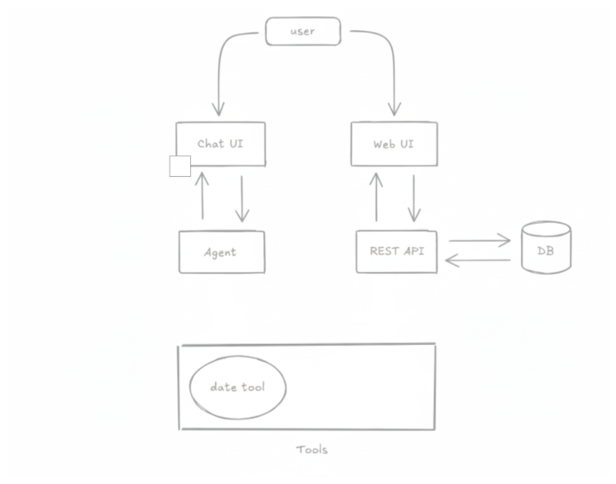

# 🧪 Model Context Protocol (MCP) Server & Client Demo

This project demonstrates how to expose existing REST APIs and Python functions as MCP servers for LLM-based applications, using FastAPI and MCP Python SDK. It includes modular services, UI frontends, and examples of multi-client, multi-model orchestration.

---


## 📊 Project Flow Diagram



---

## 📦 Project Structure

- [`app.py`](app.py): Main FastAPI application.
- [`client.py`](client.py): Example MCP client for interacting with MCP servers.
- [`dateserver.py`](dateserver.py): Example MCP server for date-related tools.
- [`main.py`](main.py): Entrypoint for running the FastAPI MCP server.
- [`models.py`](models.py): Database models and schemas.
- [`routes.py`](routes.py): FastAPI route definitions.
- [`todo_ui.py`](todo_ui.py): Streamlit UI for TODO tasks.
- [`todos.db`](todos.db): SQLite database for TODOs.
- [`requirements.txt`](requirements.txt), [`pyproject.toml`](pyproject.toml): Dependencies and project metadata.

---

## 🚀 Services & Endpoints

| Service                | Description                                   | URL                                 |
|------------------------|-----------------------------------------------|-------------------------------------|
| FastAPI MCP Server     | Main MCP endpoint (wraps REST API/tools)      | [`http://0.0.0.0:8080`](http://0.0.0.0:8080) |
| MCP Core Server        | Standalone MCP protocol server                | [`http://0.0.0.0:8000`](http://0.0.0.0:8000) |
| Chat UI (Gradio)       | Conversational interface for MCP endpoint     | [`http://127.0.0.1:7860`](http://127.0.0.1:7860) |
| TODO UI (Streamlit)    | Task list frontend for MCP TODO tools         | [`http://localhost:8501`](http://localhost:8501) |

---

## 🧠 What is Model Context Protocol (MCP)?

MCP is a protocol for exposing data and tools to LLMs in a standardized, secure way. MCP servers can:

- Expose **Resources** (like GET endpoints, for context/data loading)
- Provide **Tools** (like POST endpoints, for actions and side effects)
- Define **Prompts** (reusable LLM interaction templates)
- Enable modular, composable, multi-model and multi-client workflows

Learn more: [modelcontextprotocol.io](https://modelcontextprotocol.io)

---

## 🛠️ How to Expose REST APIs as MCP Tools

You can wrap any REST API or Python function as an MCP tool, making it accessible to LLM agents via MCP.

**Example: Wrapping a REST API endpoint as an MCP tool**

```python
from mcp.server import FastMCP
import requests

mcp = FastMCP("MyAPI")

@mcp.tool()
def get_todo(date: str):
    """Fetch TODOs for a given date from REST API."""
    response = requests.get(f"http://localhost:8080/todos?date={date}")
    return response.json()

if __name__ == "__main__":
    mcp.run(transport="http", host="0.0.0.0", port=8000)
```

Now, your REST API is available as an MCP tool for LLM-based orchestration.

---

## 🏗️ Running the Project

1. **Install dependencies**  
   ```sh
   pip install -r requirements.txt
   ```

2. **Start the FastAPI MCP server**  
   ```sh
   python main.py
   ```

3. **Start the TODO UI (Streamlit)**  
   ```sh
   streamlit run todo_ui.py
   ```

4. **Start the Chat UI (Gradio)**  
   ```sh
   python app.py
   ```

5. **Run the MCP client**  
   ```sh
   python client.py
   ```

---

## 🧩 Extending & Customizing

- Add new tools/resources in [`routes.py`](routes.py) and decorate with MCP.
- Use [`models.py`](models.py) for custom schemas.
- Build new UIs or clients for your use case.

---

## 📚 References

- [Model Context Protocol Documentation](https://modelcontextprotocol.io)
- [FastAPI-MCP Documentation](https://fastapi-mcp.tadata.com/)
- [MCP Python SDK](https://pypi.org/project/mcp/)

---

## 📝 License

MIT License ©